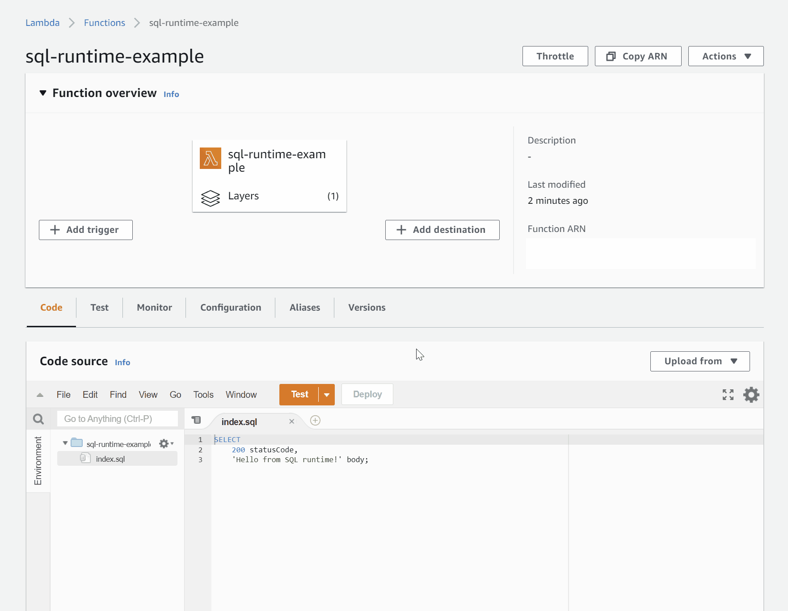

# AWS Lambda SQL Runtime

This is one of AWS Lambda crazy runtime series.



## Install

1. Download `runtime.zip` from latest release.
1. Upload `runtime.zip` as Lambda layer to AWS Lambda.
1. Add the layer to your lambda function.

## Example

### Hello World

This runtime returns last query result as json.
Next code is simple example.

```sql
SELECT
    200 statusCode,
    'Hello from SQL runtime!' body;
```

The SQL returns this response.

```json
{
  "body": "Hello from SQL runtime!",
  "statusCode": 200
}
```

### Logging

`print` function logging and return the argument.
Next code is example of using `print`.

```sql
SELECT print('Hello from SQL runtime!');
```

The SQL output this log.

```log
START RequestId: xxxxxxxx-xxxx-xxxx-xxxx-xxxxxxxxxxxx Version: $LATEST
Hello from SQL runtime!
END RequestId: xxxxxxxx-xxxx-xxxx-xxxx-xxxxxxxxxxxx
REPORT RequestId: xxxxxxxx-xxxx-xxxx-xxxx-xxxxxxxxxxxx	Duration: 109.83 ms	Billed Duration: 203 ms	Memory Size: 128 MB	Max Memory Used: 24 MB	Init Duration: 93.02 ms	
```

### Event

`event` function returns the event value of argument key.
Next code is example of using `event`.

```sql
SELECT print(event(''));
SELECT event('key1') key1, event('key2') key2; 
```

`event json`

```json
{
  "key1": "value1",
  "key2": "value2",
  "key3": "value3"
}
```

The SQL returns this response.

```json
{
  "key1": "value1",
  "key2": "value2"
}
```

And output this log.

```log
START RequestId: xxxxxxxx-xxxx-xxxx-xxxx-xxxxxxxxxxxx Version: $LATEST
{"key1":"value1","key2":"value2","key3":"value3"}
END RequestId: xxxxxxxx-xxxx-xxxx-xxxx-xxxxxxxxxxxx
REPORT RequestId: xxxxxxxx-xxxx-xxxx-xxxx-xxxxxxxxxxxx	Duration: 133.09 ms	Billed Duration: 222 ms	Memory Size: 128 MB	Max Memory Used: 24 MB	Init Duration: 88.90 ms	
```